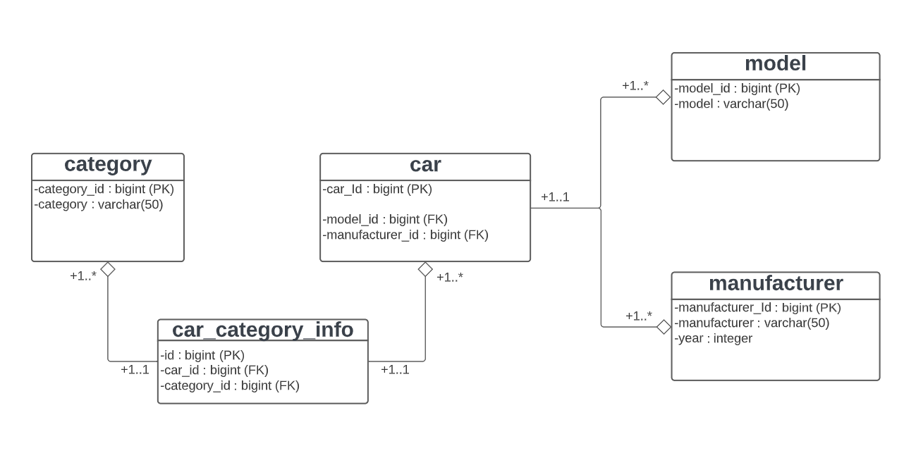

# Car-REST-Service

### UML diagram:

## About The Project

It is a RESTful application where you can perform CRUD operations to interact with the data.\
You can get data about cars or add a new one.\
You can also interact with manufacturers, categories, and models of cars.
There is swagger documentation for this app.\
After launching the application go to 'http://localhost:8080/swagger-ui.html'

## Technologies
Project is created with:

* Java 11
* REST
* Spring Boot
* Spring MVC
* Spring JPA
* Spring Security
* Keycloak
* OpenApi 3.0
* JUnit 5
* Mockito
* Testcontainers
* Postgres
* Flyway
* Docker
* Lombok

## Launching
1) Add host entry '127.0.0.1 keycloak' at C:\Windows\System32\drivers\ets\hosts
2) Run the docker-compose file located at the root of the project
3) Go to the swagger ui page 'http://localhost:8080/swagger-ui.html'

## Authorization

You can use these credentials on the swagger ui page.

### Client credentials:
**clientID:** car-service\
**secret:** Lkrcb5O89rRm01Fy8KiRX7DrYZlJ89fJ

### Roles
You can choose user with ***ADMIN***, ***STAFF*** or ***USER*** role.

User with:
* ADMIN role has access to all application endpoints
* STAFF role has access to GET and PUT endpoints
* USER role has access to GET endpoints

### Users credentials
You can use these credentials on the swagger ui page.\

#### With *ADMIN* role
**username:** jamessmith\
**password:** password

#### With *STAFF* role
**username:** roberttaylor\
**password:** password

#### With *USER* role
**username:** maryjones\
**password:** password

## Development process
1) Analysis and decomposition for the cars data were carried out.
The main entities for this project and the mapping strategies between them have been defined.
UML diagram was also created.
2) The initialization data was taken from the CSV file. After that, this data was divided into separate tables
3) DAO and service layers were created
4) REST controllers were created
5) Security was added by using the Keycloak authorization server
6) Documentation was added by using Swagger
7) The application has been dockerized
